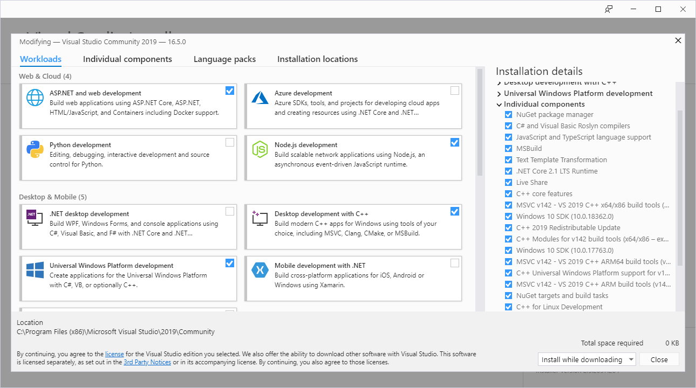

# 프로그램 설치

C/C++ 프로그래밍을 하기 위해 필요한 프로그램을 설치하는 방법에 대해 설명합니다.

## 프로그램의 종류

어떤 프로그래밍 언어를 사용하든, 프로그래밍을 위해 설치하는 프로그램은 크게 몇 가지로 나눌 수 있습니다.

1. 에디터
프로그램의 코드를 작성하기 위한 프로그램입니다. 프로그래밍을 전혀 접해보지 않은 분들도 프로그래밍을 하기 위해선 무언가 텍스트를 작성해야한다는 것을 알고 계실겁니다. 이 텍스트를 흔히 **코드(code)**나 **소스(source)**라고 부르고, 합쳐서 **소스 코드(source code)** 라고도 합니다. 에디터는 워드나 한글같은 프로그램과 달리, 소스 코드를 작성하기 위해 특화되어있습니다. 이 특화된 기능엔 무엇이 있는지 나중에 배울 예정입니다.

2. 소스 코드를 실행하기 위한 프로그램
소스 코드를 실행하기 위한 프로그램엔 여러가지가 있는데, 주로 소스 코드를 한 줄씩 읽어서
주어진 일을 처리하는 **인터프리터(interpreter)**와, 소스 코드를 한꺼번에 다 읽어서 다른 언어로 번역하는 **컴파일러(compiler)**로 분류합니다. 요즘은 인터프리터도 컴파일(compile) 기능을 갖추기도 하고, 컴파일러에서만 돌아가던 언어가 인터프리터에서 돌아가기도 하지만, 일반적으로는 이 두 가지로 분류합니다. C/C++은 컴파일러를 사용합니다.

3. 소스 코드가 잘 돌아가는지 확인하기 위한 프로그램
이 범주에 속하는 프로그램은 여러가지가 있겠지만, 일단 **디버거(debugger)**라는 프로그램만 소개하겠습니다. 디버거는 인터프리터가 소스 코드를 실행 중이거나, 컴파일된 소스 코드가 실행 중일 때 사용합니다. 프로그래머의 의도에 따라 실행을 멈추게 하거나, 어떤 값을 보거나 변경할 수 있습니다. 이를 통해 소스 코드가 프로그래머가 의도한대로인지 확인할 수 있습니다. 디버거라는 말은 버그(bug)를 수정하는 행위(debug)를 위한 프로그램이라는 뜻입니다.

저희가 이 강좌에서 사용할 프로그램은 마이크로소프트에서 만든 [Visual Studio](https://visualstudio.microsoft.com/)라고 하는 프로그램입니다.
Visual Studio는 여러 개의 프로그램으로 이루어져있습니다. 기본적으로 설치되는 건 에디터입니다. 여기에 추가로, C/C++ 뿐만 아니라 C#, Python, JavaScript 등 다양한 언어로 된 소스 코드를 실행하기 위한 프로그램과 디버거를 설치할 수 있습니다. 하지만 표면적으로 봤을 땐 하나의 프로그램처럼 동작하기 때문에 프로그래머가 쉽게 프로그래밍을 위한 준비를 할 수 있게 해 줍니다. 이런 프로그램들을 통합 개발 환경 또는 **IDE(Integrated Development Environment)** 라고 합니다.


## Visual Studio 설치

다음 링크에 접속해주세요.
```
https://visualstudio.microsoft.com/
```


중앙에 있는 세 프로그램 소개 중 가장 왼쪽의 **Download Visual Studio** 위에 마우스 커서를 올리시고, **Community 2019**를 눌러 프로그램을 다운로드해주세요. 다운로드하신 프로그램을 실행하시면 잠시 기다려달라는 메시지가 표시된 후 다음 창이 떠야 합니다.


이 중에 설치할 컴포넌트는 **Desktop development with C++**입니다. 해당 컴포넌트를 선택하셨으면 오른쪽 밑에 설치 버튼을 눌러주세요. 설치엔 오랜 시간이 걸립니다. 설치하는 동안, 다음 장을 읽어주세요.

[다음: 컴퓨터의 구조](2. 컴퓨터의 구조)