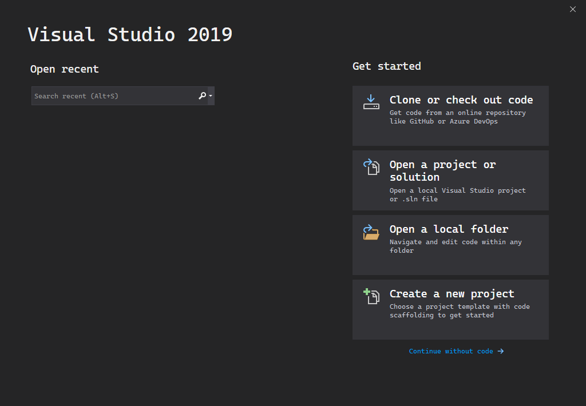
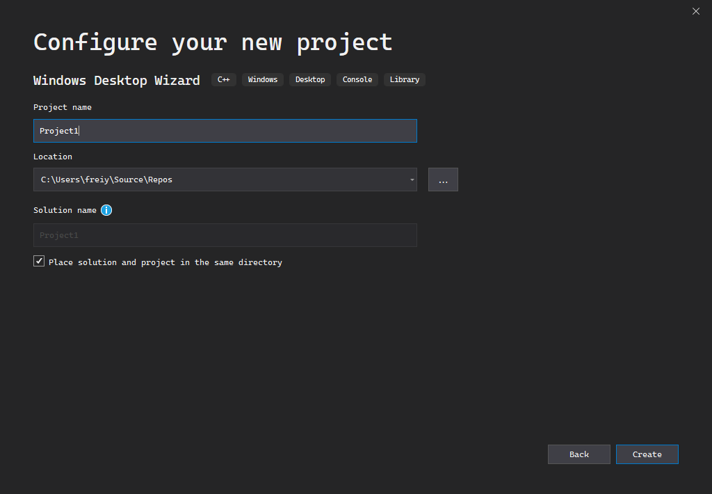
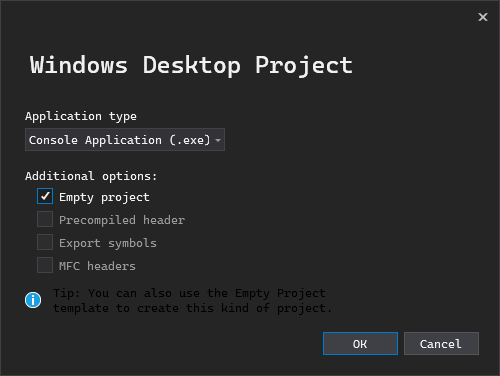
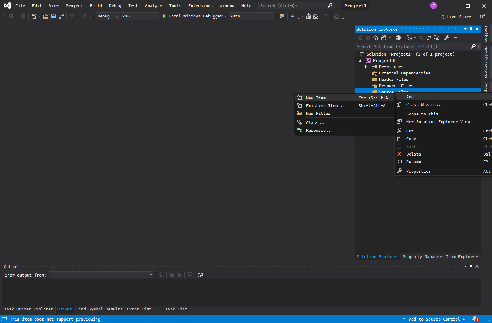
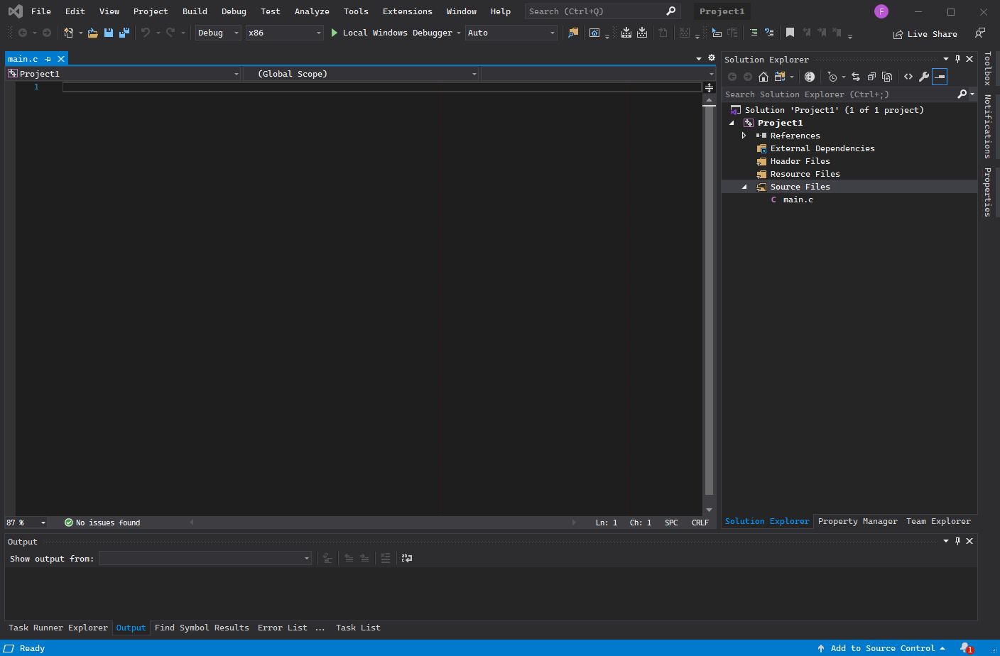
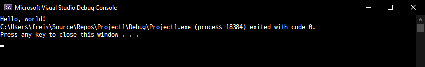

# Hello, world!

실제로 실행되는 C 코드를 작성해봅니다.

## 개발 준비

설치 후에 Visual Studio 2019를 실행하면 다음과 같은 창이 떠야 합니다. 중간에 마이크로소프트 계정으로 로그인하라는 창이 뜰텐데요, 가입 후 로그인해주시길 바랍니다. 보통 윈도우를 설치할 때 마이크로소프트 계정을 생성하기 때문에, 마이크로소프트 계정이 있으실 겁니다.



처음 창에서 `Create a new project`를 선택하신 후, `Windows Desktop Wizard`를 선택하신 후, 오른쪽 밑의 `다음`을 눌러주세요. 위에 검색 창에서 검색할 수도 있습니다.


그 다음엔 프로젝트의 기본 설정을 정하는 창이 뜹니다. 프로젝트 이름은 큰 영향을 미치지 않으니 원하시는 이름으로 해주세요. 밑에 `Place solution and project in the same directory`라는 옵션은 지금 상황에선 큰 차이를 만들지 않습니다.



여기서 오른쪽 밑에 `생성` 버튼을 누르면, 이렇게 작은 창이 하나 더 뜹니다. 여기서 설정을 다음 이미지처럼 하고, `확인`을 눌러주세요.



그럼 로딩창이 뜬 후, 큰 창이 하나 뜹니다. 큰 창 오른쪽 또는 왼쪽에, `솔루션 탐색기`라는 부분이 있습니다. 여기서 `소스 파일` 폴더를 마우스 오른쪽 버튼으로 클릭한 후, 추가, 새 아이템을 눌러주세요.



그럼 새 파일을 추가하는 창이 뜹니다. 여기서 `C++ 파일 (.cpp)`를 누르고, 이름은 `main.c`로 해주세요. 반드시 맨 끝이 `.c` 여야 합니다. `.c`는 이 파일이 C 언어 소스라는 뜻을 가지는 `확장자(extension)`입니다.


이제 본격적으로 프로그래밍을 할 준비가 되었습니다.



## Hello, world!

프로그래밍에 관심이 없는 분들도 종종 아시는 유명한 문장입니다. 이 문장은 어떤 프로그래밍 언어를 처음 배울 때, 프로그램은 잘 설치됐는지 확인하기 위해서도 써보고, 그 언어로 화면에 무언가 표시하는 기능을 배우기 위해서도 활용합니다. C에서 "Hello, world!"를 표시하는 코드는 다음과 같습니다.
```c
#include <stdio.h>

int main()
{
    printf("Hello, world!");
}
```
화면 중앙에 있는 곳을 클릭하면, 코드를 입력할 수 있게 됩니다. 이 곳에 위 코드를 따라 써 주세요.


코드를 입력하시면 왼쪽 위의 `main.c`가 `main.c*`로 바뀐 것을 확인하실 수 있습니다. 다양한 프로그램에서 파일 이름 뒤에 `*`이 붙는 것은 저장하지 않은 변경사항이 있다는 것을 뜻합니다. `Ctrl + S`를 눌러서 저장하시면 `*`이 사라지는 것을 확인하실 수 있습니다. 이제 `Ctrl + F5`를 눌러주세요. 그럼 새 창이 뜨면서, 화면에 "Hello, world!"가 표시되는 것을 확인하실 수 있습니다.



이제 C 소스 코드를 실행하는 방법을 터득하셨습니다. `Ctrl + F5`를 누르면서 코드를 편집하는 창에 변화가 하나 더 생겼는데요, 창 밑을 보시면 이런 메시지가 표시되는 것을 확인하실 수 있습니다.


이게 바로 컴파일러가 C 소스 코드를 번역하면서 표시한 메시지입니다. 이 부분에 대해선 나중에 자세히 설명하겠습니다.

## 이상한 점

그런데 이상하다고 느끼시는 점이 여러가지일 것이라고 생각합니다. 먼저, 화면에 출력되는 것이 "Hello, world!"만 있는 것이 아니었습니다. 뭔가 알 수 없는 말이 뒤에 적혀있습니다. 이 부분은 Visual Studio가 프로그래머를 위해 추가 정보를 적어두는 곳입니다. 위의 사진을 보면, `process 18384`나, `code 0` 같은 말이 적혀있는데요, 이건 나중에 오류를 찾아낼 때 중요하게 사용할 수도 있는 정보들입니다. 또 `C:\Users\...` 같은 건 이 프로그램이 들어있는 경로인데요, 나중에 파일과 관련된 일을 처리할 땐 중요하게 사용될 수도 있는 정보입니다. 또 그 밑엔 아무 키나 눌러서 창을 닫을 수 있다고 안내하고 있습니다.

두번째로 이상한 점은, 보통 프로그램과 다르게 이 창에선 글씨만 표시된다는 점입니다. 예를 들어, 여러분이 이 자료를 보실 때 사용하는 웹브라우저는 사진이나 동영상도 표시할 수 있는 프로그램입니다. 하지만 우리가 지금 만든 프로그램은 글씨밖에 표시하지 못했습니다. 이건 보통 사람들이 사용하는 프로그램은 GUI(Graphical User Interface) 프로그램인데 반해, 아까 프로젝트를 생성할 때 CLI(Command Line Interface) 프로그램을 만들도록 설정했기 때문입니다. 컴퓨터가 만들어진 초기엔 대부분의 프로그램은 다 CLI 프로그램이었습니다. 텍스트만 표시되는 화면을 보면서 필요한 작업을 했고, 마우스 같은 장치 없이 명령어를 입력하는 걸로만 컴퓨터를 조작할 수 있었습니다. 이 때문에 일반인이 컴퓨터를 쉽게 사용할 수 없었습니다. 그 이후로 소프트웨어가 발전하면서 일반인들도 편하게 사용할 수 있는 GUI 프로그램이 등장하게 되었습니다. 하지만 GUI 프로그램은 CLI 프로그램에 비해 만들기 어렵기 때문에, 프로그래밍을 처음 배울 땐 CLI 프로그램을 만드는 연습을 합니다. 나중에 GUI 프로그램을 만드는 방법에 대해 다룰 예정이니 걱정하지 않으셔도 괜찮습니다.

CLI 프로그램을 실행하기 위해 표시되는 창을 `콘솔(console)` 또는 `터미널(terminal)`이라고 부릅니다. 콘솔 창이라고도 부릅니다. 정확히 이야기하자면 이 텍스트를 표시하는 기능을 구현한 프로그램을 `터미널 에뮬레이터(terminal emulator)`라고 하고 줄여서 콘솔이나 터미널이라고 부르지만, 자세히 구분할 필요는 없습니다. CLI 프로그램은 `콘솔 애플리케이션(또는 프로그램)`이라고도 부릅니다. 프로그래밍을 더 깊숙히 배울수록, 직접 콘솔 프로그램을 사용하게 될 일이 많아지게 됩니다. 콘솔 프로그램은 처음엔 다루기 어렵지만, 복잡한 몇몇 작업을 GUI 프로그램보다 더 효율적으로 할 수 있다는 장점이 있습니다. 프로그래밍에 필요한 콘솔 프로그램들을 다루는 것도 나중에 할 예정입니다.

# 코드 부연 설명

다시 방금 코드로 돌아가봅시다.
```c
#include <stdio.h>

int main()
{
    printf("Hello, world!");
}
```
"Hello, world!" 를 표시하고 싶을 뿐인데, 부가적으로 써야하는 것들이 많습니다. 각 부분의 역할은 다음과 같습니다.

* `#include <stdio.h>`: 이 프로그램이 콘솔에 텍스트를 출력하거나 입력받는 기능을 사용하고 싶을 때 써야 하는 코드입니다.
* `int main()`: 프로그램을 실행했을 때 맨 처음 실행되는 부분을 정의합니다.
* `printf`: `#include <stdio.h>`를 썼을 때, 콘솔에 텍스트를 출력하겠다는 의미를 가집니다.

즉 이 코드를 사람들이 사용하는 말에 가깝게 고치면,

```
콘솔에 화면을 출력하는 기능이 필요합니다.

프로그램이 시작했을 때,
    "Hello, world!"를 콘솔에 출력합니다.
```

로 해석할 수 있습니다.

[다음: 변수와 포인터](../4-variables-and-pointers)