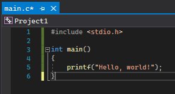

# 변수/함수와 문법

C의 변수와 함수에 대해 다루면서 C의 문법을 설명합니다.

## 개발 준비

설치 후에 Visual Studio 2019를 실행하면 다음과 같은 창이 떠야 합니다. 중간에 마이크로소프트 계정으로 로그인하라는 창이 뜰텐데요, 가입 후 로그인해주시길 바랍니다. 보통 윈도우를 설치할 때 마이크로소프트 계정을 생성하기 때문에, 마이크로소프트 계정이 있으실 겁니다.


처음 창에서 `Create a new project`를 선택하신 후, `Windows Desktop Wizard`를 선택하신 후, 오른쪽 밑의 `다음`을 눌러주세요. 위에 검색 창에서 검색할 수도 있습니다.


그 다음엔 프로젝트의 기본 설정을 정하는 창이 뜹니다. 프로젝트 이름은 큰 영향을 미치지 않으니 원하시는 이름으로 해주세요. 밑에 `Place solution and project in the same directory`라는 옵션은 지금 상황에선 큰 차이를 만들지 않습니다.


여기서 오른쪽 밑에 `생성` 버튼을 누르면, 이렇게 작은 창이 하나 더 뜹니다. 여기서 설정을 다음 이미지처럼 하고, `확인`을 눌러주세요.


그럼 로딩창이 뜬 후, 큰 창이 하나 뜹니다. 큰 창 오른쪽 또는 왼쪽에, `솔루션 탐색기`라는 부분이 있습니다. 여기서 `소스 파일` 폴더를 마우스 오른쪽 버튼으로 클릭한 후, 추가, 새 아이템을 눌러주세요.


그럼 새 파일을 추가하는 창이 뜹니다. 여기서 `C++ 파일 (.cpp)`를 누르고, 이름은 `main.c`로 해주세요. 반드시 맨 끝이 `.c` 여야 합니다. `.c`는 이 파일이 C 언어 소스라는 뜻을 가지는 `확장자(extension)`입니다.


이제 본격적으로 프로그래밍을 할 준비가 되었습니다.


## Hello, world!

프로그래밍에 관심이 없는 분들도 종종 아시는 유명한 문장입니다. 이 문장은 어떤 프로그래밍 언어를 처음 배울 때, 프로그램은 잘 설치됐는지 확인하기 위해서도 써보고, 그 언어로 화면에 무언가 표시하는 기능을 배우기 위해서도 활용합니다. C에서 "Hello, world!"를 표시하는 코드는 다음과 같습니다.
```c
#include <stdio.h>

int main()
{
    printf("Hello, world!");
}
```
화면 중앙에 있는 곳을 클릭하면, 코드를 입력할 수 있게 됩니다. 이 곳에 위 코드를 따라 써 주세요.



코드를 입력하시면 왼쪽 위의 `main.c`가 `main.c*`로 바뀐 것을 확인하실 수 있습니다. 다양한 프로그램에서 파일 이름 뒤에 `*`이 붙는 것은 저장하지 않은 변경사항이 있다는 것을 뜻합니다. `Ctrl + S`를 눌러서 저장하시면 `*`이 사라지는 것을 확인하실 수 있습니다. 이제 `Ctrl + F5`를 눌러주세요. 그럼 새 창이 뜨면서, 화면에 "Hello, world!"가 표시되는 것을 확인하실 수 있습니다.


이제 C 소스 코드를 실행하는 방법을 터득하셨습니다. `Ctrl + F5`를 누르면서 코드를 편집하는 창에 변화가 하나 더 생겼는데요, 창 밑을 보시면 이런 메시지가 표시되는 것을 확인하실 수 있습니다.


이게 바로 컴파일러가 C 소스 코드를 번역하면서 표시한 메시지입니다. 이 부분에 대해선 밑에서 자세히 설명하겠습니다.