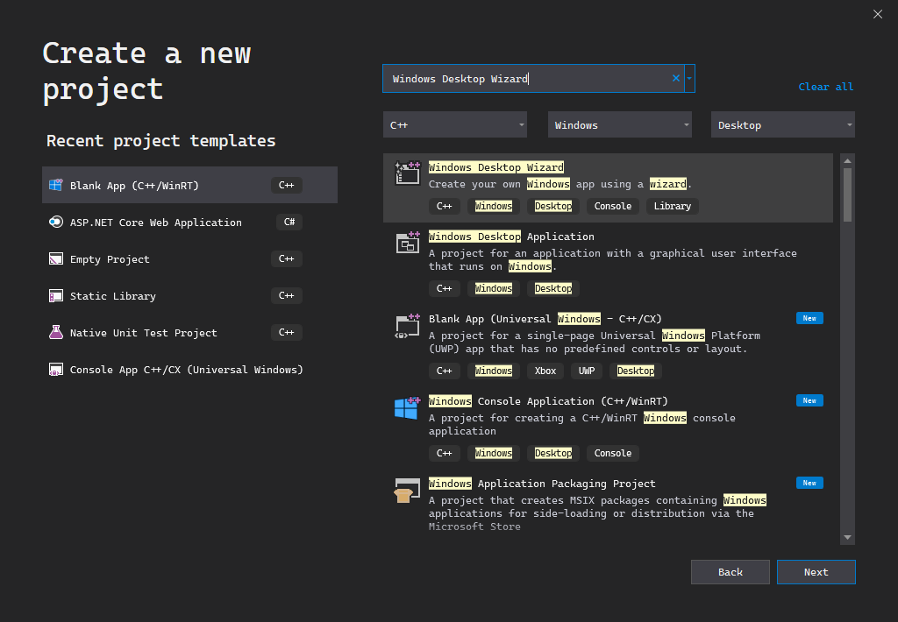
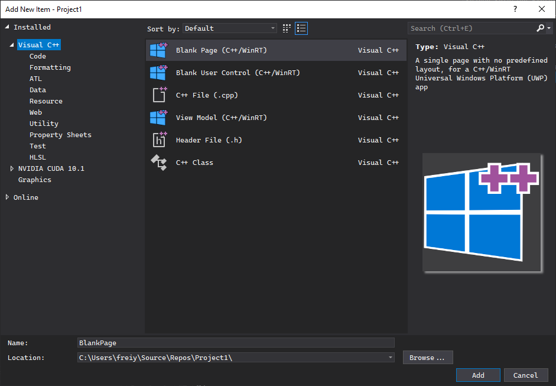

# 변수와 함수

C/C++의 변수에 대해 다룹니다.

## 개발 준비

설치 후에 Visual Studio 2019를 실행하면 다음과 같은 창이 떠야 합니다. 중간에 마이크로소프트 계정으로 로그인하라는 창이 뜰텐데요, 가입 후 로그인해주시길 바랍니다. 보통 윈도우를 설치할 때 마이크로소프트 계정을 생성하기 때문에, 마이크로소프트 계정이 있으실 겁니다.

처음 창에서 `Create a new project`를 선택하신 후, `Windows Desktop Wizard`를 선택하신 후, 오른쪽 밑의 `다음`을 눌러주세요. 위에 검색 창에서 검색할 수도 있습니다.

그 다음엔 프로젝트의 기본 설정을 정하는 창이 뜹니다. 프로젝트 이름은 큰 영향을 미치지 않으니 원하시는 이름으로 해주세요. 밑에 `Place solution and project in the same directory`라는 옵션은 지금 상황에선 큰 차이를 만들지 않습니다.

여기서 오른쪽 밑에 `생성` 버튼을 누르면, 이렇게 작은 창이 하나 더 뜹니다. 여기서 설정을 다음 이미지처럼 하고, `확인`을 눌러주세요.

그럼 로딩창이 뜬 후, 큰 창이 하나 뜹니다. 큰 창 오른쪽 또는 왼쪽에, `솔루션 탐색기`라는 부분이 있습니다. 여기서 `소스 파일` 폴더를 마우스 오른쪽 버튼으로 누른 후, 추가, 새 아이템을 눌러주세요.

그럼 새 파일을 추가하는 창이 뜹니다. 여기서 `C++ 파일 (.cpp)`를 누르고, 이름은 `main.c`로 해주세요. 반드시 맨 끝이 `.c` 여야 합니다.

이제 본격적으로 프로그래밍을 할 준비가 되었습니다.

