# 포인터와 배열

포인터와 배열에 대해 알아보고, 변수를 입력받는 방법에 대해 배웁니다.

## 메모리 주소(memory address)

[2장](../2-structure-of-computers)에서 메모리는 책장처럼 생긴 장치이고, 책장의 각 공간엔 밑에서부터 차례대로 번호가 붙어있다고 했었습니다. 이 번호를 실제로는 `메모리 주소(memory address)`라고 합니다. C에선 이 메모리 주소에 대해 덧셈과 뺄셈을 할 수 있는 기능을 제공하는데요, 이 때 `포인터(pointer)`라고 하는 자료형이 사용됩니다. 포인터는 메모리 주소를 담고 있는 자료형입니다. 즉, 일단 수학적으로 봤을 때 들어있는 형태는 정수입니다. 예를 들어 `int a`가 주소 36\~39를 차지하고 있다고 해봅시다. 그럼 포인터를 하나 만들고, 거기에 `int a`를 저장하는 공간의 가장 밑부분인 `36`을 그 포인터에 저장할 수 있습니다. 이 메모리 주소에 원하는 정수를 더하거나 빼는 것도 가능합니다.

## 포인터 선언하기

포인터 변수는 변수를 선언할 때, 변수 앞에 `*`를 붙여서 선언할 수 있습니다.

> 별표`*`는 `애스터리스크(asterisk)`라는 이름이 있는데요, 다들 별표나 star라고 부릅니다.

```c
int main()
{
    int i = 5;
    int *p;
    p = &i;
}
```
변수 `i`는 지금까지 써 왔던 변수와 똑같습니다. 반면에, 변수 `p`는 선언할 때 앞에 `*`을 붙였기 때문에 포인터가 됩니다. 이 예제에서 알 수 있는 것은 여러가지인데요, 

* `p = &i`라는 식을 통해 `&`가 변수의 주소를 반환하는 단항 연산자임을 알 수 있습니다.
* 포인터를 선언할 땐 항상 어떤 자료형의 변수의 주소를 담을 건지 명시해야함을 알 수 있습니다.
* `*`가 변수의 선언에서 변수의 이름 앞에 붙으면 포인터임을 나타내는 표시가 된다는 것을 알 수 있습니다. `*`가 곱하기 말고도 여러 역할을 하는 것처럼, C에선 모양은 같지만 역할은 다른 경우가 여러가지 있습니다.

이 때 포인터 `p`의 자료형을 `int *`이라고 하는데요, 이 자료형을 풀어서 `int를 가리키는 포인터(a pointer to an integer)`라고도 합니다.

> `int`와 `*`은 다른 토큰으로 분리될 수 있기 때문에 `int* p` 라고 적어도 `p`가 포인터가 됩니다.

> `&`는 `주소 연산자(Address-of operator)`라고 불립니다. 주소 연산자는 형변환 연산자처럼 우선순위가 산술 연산자들보다 높고, 결합방향이 오른쪽에서 왼쪽입니다.

> `&`라는 기호 자체도 `앰퍼샌드(ampersand)`라는 이름이 있습니다.

그럼 이 예제를 사람들이 쓰는 말에 가깝게 쓰면
```
프로그램이 시작했을 때,
    적당한 공간을 i라고 이름 짓고 정수 5를 넣습니다.
    적당한 공간을 p라고 이름 짓습니다.
    p라는 이름의 공간에 i의 주소를 담습니다.
```
가 됩니다. 즉, i가 48\~51번을 차지하고 있다면 p에는 48이 들어있게 됩니다.

> 포인터가 가리키는 자료형이 `float`이나 `double`이라고 하더라도 포인터는 메모리 주소를 담는 자료형이기 때문에 항상 정수를 담습니다. 이 때문에 포인터는 어떤 자료형을 가리키든간에 항상 같은 크기를 가지는데요, 보통 4바이트 또는 8바이트의 크기를 가집니다. 이것에 대해서는 나중에 자세히 다루도록 하겠습니다.

변수를 한 번에 여러 번 선언할 수 있는 것처럼, 포인터도 한 번에 여러 번 선언할 수 있습니다.
```c
int main()
{
    int *p, i = 5, *q = &i;
}
```
여기서 `p`와 `q`는 포인터이고, `i`는 그냥 자료형이 `int`인 변수입니다. 포인터 `p`는 초기식이 없기 때문에 어떤 값이 들어있는지 모르고, `q`는 초기식 `&i`가 주어졌기 때문에 `i`의 주소값을 갖게 됩니다.

## 포인터를 이용한 참조

[4장](../4-types-and-variables)에서 메모리 주소로만 프로그래밍을 하면 큰 프로그램을 개발하기 힘들어지기 때문에 변수라는 것이 생겼다는 설명을 했습니다. 여기서 특정한 메모리 공간에 값을 불러오고 계산한 후 다시 넣는 것을 변수라는 도구로 **추상화**할 수 있음을 배웠습니다. 포인터는 메모리 주소를 직접적으로 다룰 수 있는 도구입니다. 다시 말해, 메모리 공간에 들어있는 값을 넣고 빼고 계산할 수 있는 작업을 포인터로도 할 수 있습니다.
```c
#include <stdio.h>

int main()
{
    int i = 5;
    int *p;
    p = &i;
    *p = 6;
    printf("%d ", i);
    printf("%d", *p + 7);
}
```
```
6 13
```
여기서 `int *p;`와 `p = &i;`를 지우고, `*p`를 `i`로 교체해도 결과는 같습니다. 즉, `*p`가 `i`를 대체할 수 있는 것입니다. 이렇게 `*`은 곱셈 이항 연산자가 아니라 단항 연산자로 쓰였을 때, 포인터가 원래 가리키고 있는 변수를 가져올 수 있게 해주는 역할을 합니다. 이 예제를 컴파일했을 때 `i`가 64\~67번을, `p`가 68\~71번을 차지하고 있다고 가정해봅시다. 그럼 이 프로그램을 사람이 하는 말에 가깝게 옮기면,

| 문장 | 설명 | 실행 후 메모리 상태 |
| --- | --- | --- |
| `int i = 5;` | 64번을 `i`라고 이름 짓고, `i`라는 이름의 공간에 `5`를 넣습니다. |  |
| `int *p;` | 68번을 `p`라고 이름 짓습니다. | 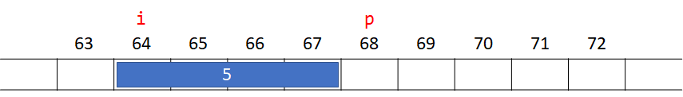 |
| `p = &i;` | `p`라는 이름의 공간에 `i`라는 이름의 공간의 메모리 주소를 넣습니다. | 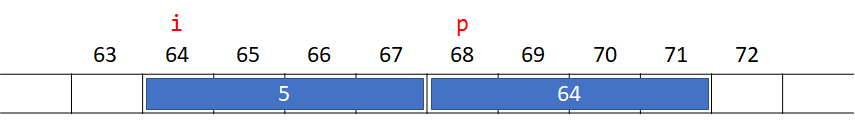 |
| `*p = 6;` | `p`라는 이름의 공간에 들어있는 메모리 주소를 가지는 공간에 `6`을 넣습니다. | 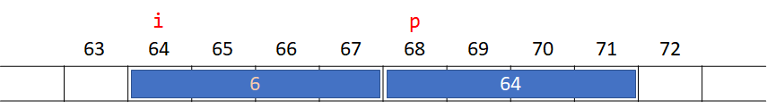 |
| `printf("%d ", i);` | `i`라는 이름의 공간에 들어있는 값을 출력합니다. (6 출력) |  |
| `printf("%d", *p + 7)` | `p`라는 이름의 공간에 들어있는 메모리 주소를 가지는 공간에 들어있는 값에 7을 더한 값을 출력합니다. (13 출력) |  |

이렇게 해석될 수 있습니다. 각 문장의 설명과 실행 후 메모리 상태를 유심히 봐주세요.

> `*`은 `참조 연산자(indirection operator)`라고 불립니다. 참조 연산자는 주소 연산자처럼 우선순위가 산술 연산자들보다 높고, 결합방향이 오른쪽에서 왼쪽입니다.

> `int *p;`같이 변수를 선언할 때의 `*`과 `*p = 6;`같이 식을 사용했을 때의 `*`은 다른 의미를 가집니다. 전자는 그 변수가 포인터라는 표시이고, 후자는 포인터 앞에 붙어 그 포인터가 가리키는 변수를 가져오는 연산자입니다.

초기화되지 않았거나 대입되지 않은 포인터는 안에 어떤 주소가 들어있는지 모르기 때문에, 그런 포인터들에 참조 연산자를 사용하는 것도 정의되지 않은 행동입니다. 이것에 대한 자세한 설명은 나중에 다루도록 하겠습니다.

## 좌측값(lvalue)와 우측값(rvalue)

지금까지의 예제에선 대입 연산자의 좌항엔 항상 변수가 들어갔습니다. [5장](../5-basic-operators)에서 대입 연산자에서 자주 나오는 실수들에 대해 다뤘을 때, `a + 1 = 5`에서 `a + 1`이 주소를 가지는 변수가 아니기 때문에 대입 연산자의 좌항에 나오지 못한다고 설명했지만, 방금 위의 예제에선 변수가 아닌 식 `*p`가 대입 연산자의 왼쪽에 들어갔습니다. 그런데, `a`, `a + 1`, `*p` 모두 자료형은 `int`로, 자료형에는 차이가 없습니다. 그럼 C 컴파일러는 대입 연산자의 왼쪽에 올 수 있는 식을 어떻게 구분할까요?

C에선 식이 가질 수 있는 값을 `좌측값(lvalue)`과 `우측값(rvalue)`로 구분합니다. 좌측값은 그 값을 담고 있는 메모리 주소를 알 수 있는 값입니다. 예를 들어, 변수 `i`가 `5`라는 값을 가지고 있을 때, 식 `i`는 결과값이 `5`인 좌측값입니다. 즉, `5`가 담겨있는 메모리 주소를 알 수 있습니다. 마찬가지로, 변수 `p`가 `i`의 주소값을 가지는 포인터라면, 식 `*p`는 결과값이 `5`인 좌측값입니다. 포인터 `p`는 그 자체로도 변수이기 때문에, 식 `p`는 결과값이 `i`의 주소인 좌측값입니다. 반대로 식 `i + 1`은 결과값이 `6`이지만, 좌측값은 아닙니다. `6`이 들어있는 메모리 주소를 알 수 없습니다. 마찬가지로, 식 `*p * 6`은 결과값이 `30`이지만, 좌측값은 아닙니다. 이렇게 좌측값이 아닌 값들을 우측값이라고 합니다.

대입 연산자의 왼쪽에 들어갈 수 있는 값은 바로 좌측값들입니다. 좌측값이라는 이름은 대입 연산자의 왼쪽에서 올 수 있다는 특징에서 유래했습니다. 마찬가지로 단항 연산자 `&`를 적용할 수 있는 식들은 결과값이 좌측값이어야 합니다. 다시 말해, `&(i + 1)`은 잘못된 식이지만, `&*p`는 올바른 식입니다.

초기화되지 않은 포인터에 참조 연산자를 사용해도 그 값은 좌측값입니다. 포인터가 어디를 가리키고 있는지는 모르겠지만, 결과값이 그 포인터가 가리키고 있는 공간에 들어있는 값이 되고, 결과값이 들어있는 주소를 포인터가 갖고 있는 주소로 특정할 수 있습니다.

> 여기서 `~의 결과값은`이란 표현은 제가 `~ is evaluated as`라는 표현을 번역한 것입니다.

> C++ 표준에선 식이 가질 수 있는 값을 lvalue, prvalue, xvalue, glvalue, rvalue 다섯가지로 구분합니다. 이것과 관련된 정확한 구분은 C++에 대해 배울 때 다루겠습니다.

다음 코드를 Visual Studio 에디터에 입력해주세요.
```c
int main()
{
    int a = 4;
    a + 1 = 5;
}
```

`a`에 빨간줄이 뜨면서 에디터에서 에러 메시지를 표시하는 것을 확인할 수 있습니다.

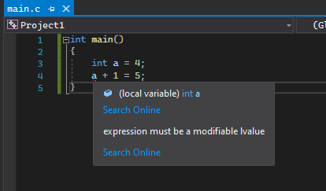

"expression must be a modifiable lvalue", 즉 "표현식이 수정 가능한 좌측값이어야 합니다"입니다. 실제로 `Ctrl + F5`를 눌러 실행해보려고 하면 컴파일러가 비슷한 메시지와 함께 에러를 표시하는 것을 확인할 수 있습니다.

## 포인터의 포인터(a pointer to a pointer)

포인터는 변수의 메모리 주소를 직접적으로 다루기 위한 자료형입니다. 그런데, 포인터 자체도 변수입니다. 그래서 C에서는 포인터의 포인터도 만들 수 있습니다.

```c
#include <stdio.h>

int main()
{
    int i = 15, *p = &i, **pp = &p;
    printf("%d %d %d", i, *p, **pp);
}
```
```
15 15 15
```

변수 `p`의 자료형이 `int *`인 것처럼, `pp`도 자료형이 `int **`이고, 풀어서 `int를 가리키는 포인터를 가리키는 포인터(a pointer to a pointer to an integer)`라고 하고, 간단하게 `이중 포인터(double pointer)`라고도 합니다.

식 `**pp`는 참조 연산자의 결합방향에 의해 `*(*pp)`로 해석됩니다. `*pp`는 결과값이 `&i`인 `int *` 좌측값으로, `p`와 같습니다. 따라서 `*(*pp)`는 `*p`와 같습니다.

> 여기서도 마찬가지로 `int **pp;`에서의 `**`과 `printf("%d", **pp)`에서의 `**`가 다른 역할을 합니다. 전자는 `pp`가 이중포인터라는 것을 표시하는 것이고, 후자는 `pp`가 가리키는 포인터가 가리키는 정수를 가져올 수 있도록 참조 연산자 `*`가 두 번 쓰인 것입니다.

> `*`이 여러개 붙어도 각 글자가 다른 토큰으로 분리됩니다. 즉, `int **pp`라고 쓰면 `int`, `*`, `*`, `pp`로 토큰화됩니다. 그래서 `int * * pp`라고 적어도, `int** pp`라고 적어도 `pp`가 전부 이중 포인터가 됩니다.

이중 포인터가 있는 것처럼 `삼중 포인터(triple pointer)`도 있고, 그 이상도 있습니다.

```c
int main()
{
    int i = 15;
    int *p1 = &i;
    int **p2 = &p1;
    int ***p3 = &p2;
    int ****p4 = &p3;
}
```

> 삼중 포인터부터는 잘 쓰이지 않습니다.

## 변수 입력받기

컴퓨터의 작동은 입력/계산/출력 세 가지로 분류할 수 있습니다. 지금까지 계산과 출력은 많이 했지만, 입력은 한 번도 한 적이 없는데요, 드디어 변수를 입력받는 방법을 다룰 수 있게 되었습니다. 출력을 `printf`라는 걸로 했던 것 처럼, 입력은 `scanf`라는 걸로 합니다. `scanf`를 사용하기 전, 필요한 사전작업이 있습니다. 솔루션 탐색기에서 프로젝트를 마우스 오른쪽 버튼으로 클릭한 후, `속성`을 눌러주세요.

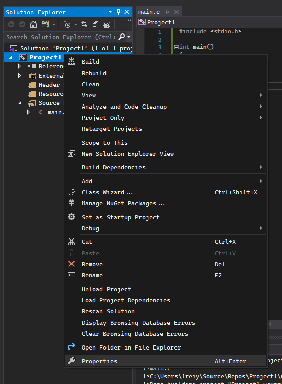

그럼 다음과 같이 프로젝트의 속성 설정 창이 표시됩니다. 여기서 왼쪽의 메뉴에서 `C/C++` > `전처리기(Preprocessor)` 메뉴에 들어가주세요.

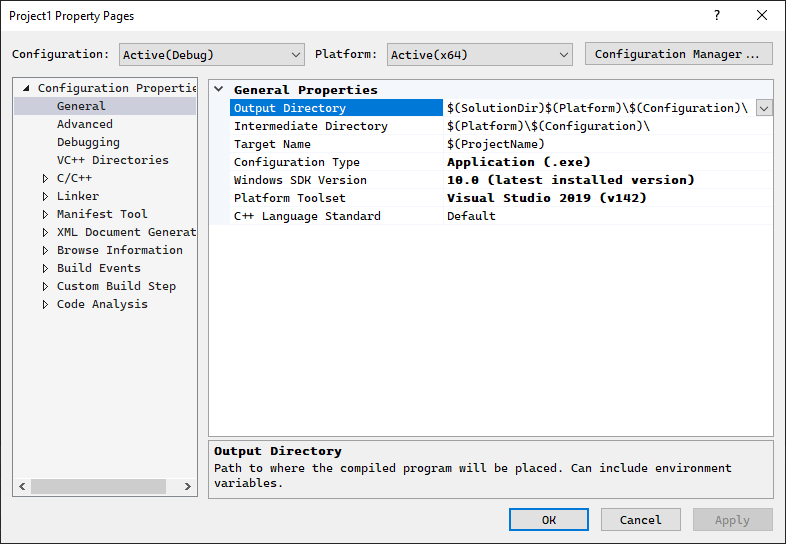

여기서 `Configuration`과 `Platform`을 모두 `All Configurations`과 `All Platforms`으로 바꾼 후, `Preprocessor Definitions`에 `_CRT_SECURE_NO_WARNINGS;`를 맨 앞에 넣어주세요. `_CRT_SECURE_NO_WARNINGS;` 까지 넣으신 것을 확인하셨으면 확인을 눌러주세요.

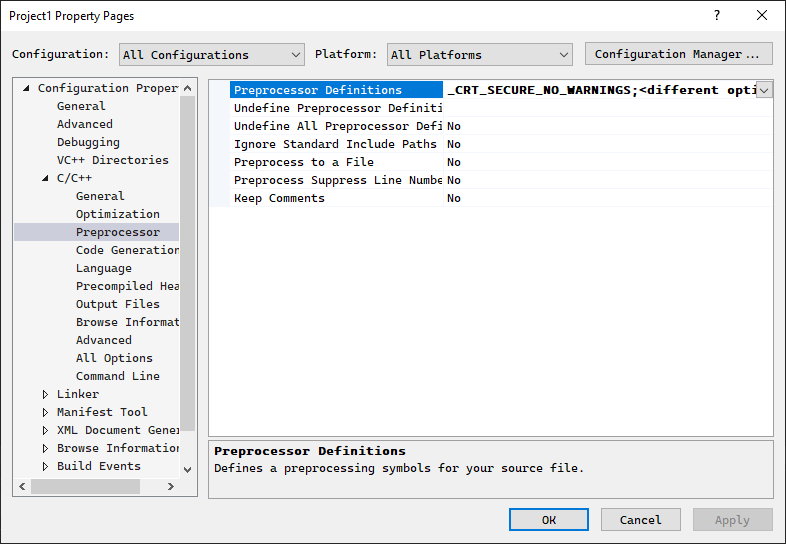

> Visual Studio의 컴파일러는 `scanf`에 보안 문제가 있어 `scanf` 사용을 원칙적으로 금지합니다. 하지만 저희는 C 문법을 배우고 있기 때문에, `scanf`를 사용하는 것은 큰 문제가 되지 않습니다. 이 작업은 그 금지 규칙을 해제하기 위한 것입니다.

다음 코드를 실행해주세요.
```c
#include <stdio.h>

int main()
{
    int i;
    int *p = &i;
    scanf("%d", p);
    printf("%d", i * 2);
}
```

프로그램이 실행하면, 커서가 깜빡이면서 아무것도 뜨지 않습니다.

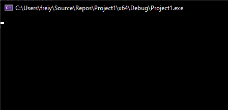

이 상태로 무언가 입력하면, 글씨가 뜹니다. 백스페이스도 작동하고요.

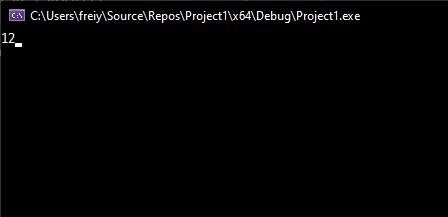

이 상태로 엔터를 눌러주세요.

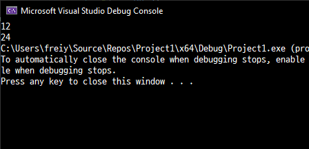

```
: 12
24
```

> 앞으로 `:`는 사용자의 입력 예시를 나타내는 표시로 사용하겠습니다.

입력한 정수의 두 배가 되는 정수가 출력된 것을 확인할 수 있습니다. 이 예제에서 `i`가 메모리 공간 120\~123을, `p`가 124\~127을 차지하고 있다고 가정하고, 각 문장을 자세히 살펴보겠습니다.

| 문장 | 설명 | 실행 후 메모리 상태 |
| --- | --- | --- |
| `int i;` | 120번을 `i`라고 이름 짓습니다. | 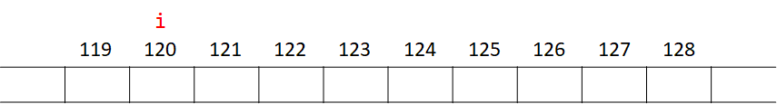 |
| `int *p = &i;` | 124번을 `p`라고 이름 짓고 `i`라는 이름의 공간의 메모리 주소를 넣습니다. | 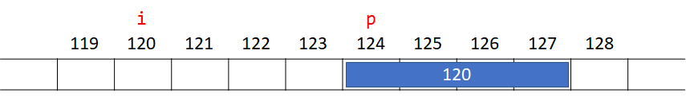 |
| `scanf("%d", p);` | `p`라는 이름의 공간에 들어있는 메모리 주소를 가지는 공간에 사용자로부터 입력받은 정수를 넣습니다. (12 입력) | 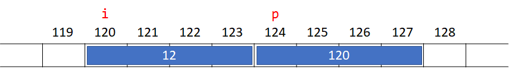 |
| `printf("%d", i * 2)` | `i`라는 이름의 공간에 들어있는 값에 2을 곱한 값을 출력합니다. (24 출력) |  |

이렇게 `scanf`는 `printf`와 다르게 그 변수를 가리키는 포인터를 써야합니다. 위 예제에선 포인터 변수를 선언했지만, 변수 대신에 항상 식을 쓸 수 있다는 것을 잊지 말아주세요.

```c
#include <stdio.h>

int main()
{
    int i; scanf("%d", &i);
    printf("%d", i * 2);
}
```
```
: 12
24
```

`scanf`도 `printf`처럼 여러 값을 받을 수 있고, `printf`와 같은 형식 지정자를 사용합니다.

```c
#include <stdio.h>

int main()
{
    int i;
    double j; scanf("%d %lf", &i, &j);
    printf("%lf", j / i);
}
```
```
: 1 0.5
0.500000
```
`scanf`는 값을 스페이스 말고 엔터로도 구분합니다. 따라서 위의 예제를 실행했을 때,
```
: 1
: 0.5
```
로 입력해도 출력이 같습니다.

## 배열(array)

[4장](../4-types-and-variables) 도입부에서 소개한 BMI 프로그램을 다시 예시로 들겠습니다. 이제 변수도 쓸 수 있겠다, 입력도 받을 수 있겠다, 이제 프로그램을 만들어서 판매한 후 부자가 되는 일만 남은 것 같습니다. 빨리 돈을 벌고 싶으니 프로그램을 작성해보겠습니다.

```c
int main()
{
    int height_1, weight_1;
    int height_2, weight_2;
    int height_3, weight_3;
    ...
    int height_199, weight_199;
    int height_200, weight_200;
}
```

그런데 마침 프로그램을 판매하려고 했던 체육관에 사람들이 몰려 사용자 2000명의 BMI를 저장한 후 계산해야한다고 합니다. 회원 수가 급증하니 체육관이 더 발전해서 10000명의 회원이 등록하게 될 가능성이 충분히 있어 보입니다. 위에서 했던 일을 수십번 더 반복하는 건 좋은 일이 아닌 것 같습니다.

C에선 이렇게 비슷한 값들을 많이 받게 되는 경우를 위해 `배열(array)`이라는 것을 만들 수 있습니다. 배열은 같은 자료형을 가지는 값 여러개를 연속적인 메모리 공간에 저장한 것입니다. 이 값들의 개수는 프로그래머가 임의로 조절할 수 있습니다. 이 개수를 배열의 `길이(length)` 또는 `크기(size)`라고 합니다. 이 강좌에선 혼동을 방지하기 위해, 길이라는 용어를 사용하겠습니다. 배열이 갖고 있는 각각의 값을 `원소(element)`라고 합니다. 배열은 변수를 선언할 때, 변수의 이름 뒤에 길이를 표시하는 것으로 만들 수 있습니다. 다음 예시를 봐주세요.

```c
int main()
{
    int i = 1;
    int arr[3];
    arr[0] = 2;
    arr[i] = 1 + arr[0];
    arr[i + 1] = 5;
    printf("%d %d %d", arr[0], arr[1], arr[2]);
}
```
```
2 3 5
```

이 예제에서 알 수 있는 점은 다음과 같습니다.

* `arr`이란 이름에 `[3]`을 붙였더니, `arr[0]`, `arr[1]`, `arr[2]`라는 변수처럼 보이는 것 세 개가 만들어졌습니다. 즉, 배열의 길이를 N으로 선언했을 때, `<배열의 이름>[0]` 부터 `<배열의 이름>[N - 1]`까지 N개를 사용할 수 있습니다.
* `[]`안에는 리터럴만 넣을 수 있는 것이 아니라 식을 넣을 수 있습니다. 즉, `[]`는 괄호 왼쪽과 안쪽에 피연산자를 집어넣는 이항 연산자이면서, 참조 연산자 `*`처럼 결과가 좌측값이 됩니다.

> `[]`는 `첨자 연산자(subscript operator)`라고 불립니다. 첨자 연산자의 `[]` 안에 들어있는 값을 `첨자(index)`라고도 부릅니다.

다른 변수 선언과 마찬가지로, 배열도 한번에 여러 개 선언할 수 있고, 초기식도 넣을 수 있습니다.

```c
#include <stdio.h>

int main()
{
    int i = 1, arr[10], arr2[3] = { 7, 11, 13 }, *j;
    printf("%d %d %d", arr2[0], arr2[1], arr2[2]);
}
```
```
7 11 13
```

여기서 `{}`도 여러 역할을 하는 것을 알 수 있습니다. `int main() { ... }`에서도 쓰이고, 배열을 초기화할 때도 쓰이는 것을 알 수 있습니다.

이 예제에선 `arr2`의 길이가 3이었지만, `arr2`의 길이가 10000이라면 초기식에 숫자를 10000개 써야할까요? 변수를 10000개 만드는 것만큼이나 번거로워보입니다. 다행히도 C를 만든 사람들은 이런 경우에도 대처할 수 있는 방법을 만들었습니다.

```c
#include <stdio.h>

int main()
{
    int arr1[1000] = { 2, 3, 5, 7, };
    int arr2[500] = { 1, 1, 2 };
    int arr3[20] = { 0 };
    printf("%d %d %d", arr1[4], arr2[3], arr3[1]);
}
```
```
0 0 0
```

`arr1[3]`의 값이 `7`인 건 확실한데, `arr1[4]`부터는 값을 모르겠습니다. `arr2[3]`과 `arr3[1]`도 마찬가지고요. 그런데 실행해보면 전부 값이 `0`인 것을 알 수 있습니다. 왜냐하면 배열에 초기식이 주어지면 숫자를 쓰지 않은 부분부터 전부 `0`으로 초기화되도록 정해져있기 때문입니다. 이 기능 덕분에 배열의 길이가 아무리 길어도 전부 `0`으로 초기화하는 것이 가능하고, 정의되지 않는 행동을 막을 수 있습니다.

> `arr1`의 초기식에서 `7`다음의 `,`에 주목해주세요. 오타가 아니라 실제로 허용되는 문법입니다. 이렇게 초기식으로 사용되는 `{}` 안에선 `,`을 계속 이어서 쓸 수 있습니다.

C를 만든 사람들은 배열을 더 쉽게 쓸 수 있도록 하기 위해 배열의 초기식이 주어지면 배열의 길이를 생략할 수도 있게 했습니다.

```c
#include <stdio.h>

int main()
{
    int arr1[] = { 2, 3, 5, 7, };
    double arr2[] = { 1, 1, 2 };
    printf("%d %lf", arr1[2], arr2[1]);
}
```
```
5 1.000000
```

위 코드를 Visual Studio 에디터에 입력하신 후, `arr1`과 `arr2` 위에 마우스를 올려주세요. 뭐가 표시되나요?

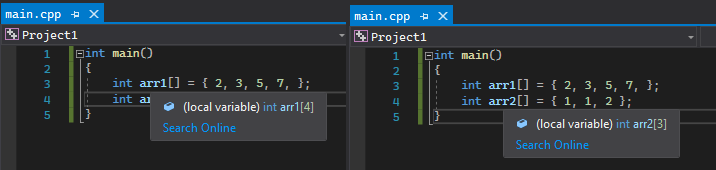

바로 `int arr1[4]`과 `double arr[3]`가 표시되는 것을 알 수 있습니다. 이렇게 초기식 안에 들어있는 숫자의 개수에 맞추어 배열의 크기를 조정할 수 있다는 것을 알 수 있습니다.

## 배열을 사용할 때 메모리 상태

배열은 같은 자료형을 가지는 값을 메모리 상의 **연속적인 공간**을 차지하고 있는 것이라고 했습니다. 예를 들어, `int arr[3]`가 있다면, `int`가 `3`개 연속적으로 메모리에 있다는 것입니다. 즉, `arr[0]`이 280\~283을 차지하고 있다면, `arr`은 280\~291, 총 12바이트를 차지하고 있게 됩니다. 다음 예제를 봐주세요.

```c
#include <stdio.h>

int main()
{
    int arr[3] = { 2, };
    scanf("%d", &arr[1]);
    int lhs = arr[0];
    int rhs = arr[1];
    int res = lhs * rhs;
    arr[2] = res;
    printf("%d ", arr[0]);
    printf("%d ", arr[1]);
    printf("%d", arr[2]);
}
```
```
: 5
2 5 10
```

`lhs`, `rhs`, `res`가 각각 292\~295, 296\~299, 300\~304을 차지하고 있다고 가정하겠습니다.

| 문장 | 설명 | 실행 후 메모리 상태 |
| --- | --- | --- |
| `int arr[3] = { 2, };` | 280번을 `arr`라고 이름 짓고, `arr[0]`부터 `2`, `0`, `0`을 넣습니다. | 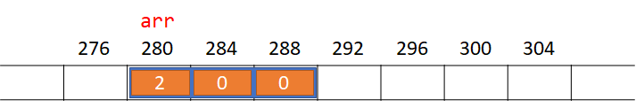 |
| `scanf("%d", &arr[1]);` | `arr`라는 이름의 공간의 주소에(= 280), `int`의 크기에 첨자 `1`을 곱한 결과(= 4)를 더한 주소의 공간(= 284)에 사용자가 입력한 정수를 넣습니다. (5 입력) |  |
| `int lhs = arr[0];` | 292번을 `lhs`라고 이름 짓고, `arr`라는 이름의 공간의 주소에(= 280), `int`의 크기에 첨자 `0`을 곱한 결과(= 0)를 더한 주소의 공간(= 280)에 들어있는 값을, `lhs`라는 이름의 공간에 넣습니다. | 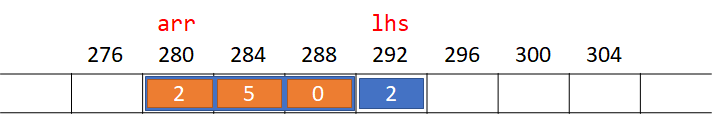 |
| `int rhs = arr[1];` | 296번을 `rhs`라고 이름 짓고, `arr`라는 이름의 공간의 주소에(= 280), `int`의 크기에 첨자 `1`을 곱한 결과(= 4)를 더한 주소의 공간(= 284)에 들어있는 값을, `rhs`라는 이름의 공간에 넣습니다. | 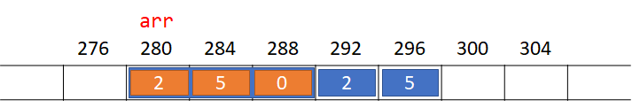 |
| `int res = lhs * rhs;` | 300번을 `res`라고 이름 짓고, `lhs`라는 이름의 공간에 들어있는 값과 `rhs`라는 이름의 공간에 들어있는 값을 곱한 결과를, `res`라는 이름의 공간에 넣습니다. | 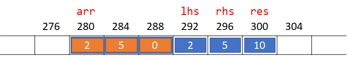 |
| `arr[2] = res;` | `arr`라는 이름의 공간의 주소에(= 280), `int`의 크기에 첨자 `2`를 곱한 결과(= 8)를 더한 주소의 공간(= 288)에, `res`라는 이름의 공간에 들어있는 값을 넣습니다. |  |
| `printf("%d ", arr[0]);` | `arr`라는 이름의 공간의 주소에(= 280), `int`의 크기에 첨자 `0`을 곱한 결과(= 0)를 더한 주소의 공간(= 280)에 들어있는 값을 출력합니다. (2 출력) |  |
| `printf("%d ", arr[1]);` | `arr`라는 이름의 공간의 주소에(= 280), `int`의 크기에 첨자 `1`을 곱한 결과(= 4)를 더한 주소의 공간(= 284)에 들어있는 값을 출력합니다. (5 출력) |  |
| `printf("%d", arr[2]);` | `arr`라는 이름의 공간의 주소에(= 280), `int`의 크기에 첨자 `2`을 곱한 결과(= 8)를 더한 주소의 공간(= 288)에 들어있는 값을 출력합니다. (10 출력) |  |

여기서 `arr[n]`은 정확히 어떤 일을 하나요? `arr`의 주소를 `p`라고 했을 때, `p+n×4`를 계산한다는 것을 알 수 있습니다. 만약 `arr`의 원소가 `int`가 아니라 `double`이었다면 `arr[n]`은 `int`의 크기인 `4`가 아니라 `8`을 사용하여 `p+n×8`을 계산하는 식이 되었을 것입니다. 즉, 첨자 연산자는 실제로는 배열이 담는 값들의 자료형의 크기를 곱한 후 배열이 가지는 주소에 더하는 연산을 한다는 것을 알 수 있습니다.

## `sizeof` 연산자

C에선 위 예제처럼 자료형의 크기 자체가 중요해지는 경우가 몇몇 있습니다. 첨자 연산자는 알아서 자료형의 크기를 곱해줬지만, 직접 프로그래머가 자료형의 크기로 식을 만들어야 하는 경우가 있습니다. 이 때 `sizeof` 단항 연산자를 사용합니다. `sizeof`도 산술 연산자보다 우선순위가 높고, 결합 방향이 오른쪽에서 왼쪽입니다. `sizeof`의 사용 방법은 두 가지입니다.

1. 결과값이 주어진 식의 자료형의 크기가 됩니다.
```
sizeof <식>
```

2. 결과값이 주어진 자료형의 크기가 됩니다.
```
sizeof(<자료형>)
```

실제 사용 예시를 보겠습니다.

```c
#include <stdio.h>

int main()
{
    int i = sizeof(int), j = sizeof 2, k = sizeof(double);
    printf("%d %d %d", i, j, k);
}
```
```
4 4 8
```

먼저 리터럴 `2`의 결과는 `int`이므로, `sizeof 2`의 결과는 `int`의 크기인 `4`가 됩니다. `sizeof(int)`와 `sizeof(double)`의 결과는 각 자료형의 크기인 `4`와 `8`이 됩니다. 따라서, `4 4 8`이 출력되게 됩니다.

> `sizeof` 연산자의 결과는 자료형이 `int`가 아닙니다. 따라서, `printf("%d", sizeof 2);`는 정의되지 않는 행동을 발생시킵니다. 위 예제에선 암시적인 축소 변환이 일어나고 있습니다. `sizeof`의 자료형에 대해선 나중에 다루겠습니다.

> 자료형 대신 식을 사용했을 때 괄호가 없는 것에 주목해주세요. `(i + 1) + 2` 대신에 `i + 1 + 2`라고 쓸 수 있는 것 처럼, `2` 대신에 `(2)`라고도 쓸 수 있습니다. 그래서 `sizeof 2` 대신에 `sizeof(2)`라고도 쓸 수 있습니다. C를 이미 해보셨던 분들은 괄호가 있는 것에 익숙하실 텐데, 식의 경우엔 괄호를 생략할 수 있습니다.

포인터에도 `sizeof` 연산자를 적용할 수 있습니다.

```c
#include <stdio.h>

int main()
{
    int *p, i = sizeof p, j = sizeof(int *);
    printf("%d %d", i, j);
}
```
```
4 4
```

> 프로그램을 실행한 컴퓨터나 환경에 따라 `8 8`이 출력될 수도 있습니다.

그럼 배열에 사용하면 어떻게 될까요?

```c
#include <stdio.h>

int main()
{
    double arr1[2];
    int arr2[3];
    int i = sizeof arr1, j = sizeof arr2;
    printf("%d %d", i, j);
}
```
```
16 12
```

`sizeof`의 결과가 배열이 담는 자료형의 크기가 아니라, `자료형의 크기×배열의 길이`임을 알 수 있습니다. 이런 특성을 활용하면 배열의 크기를 쉽게 구할 수 있습니다.

> 제가 `배열의 크기`라고 말한 것에 주목해주세요. 앞으로 변수에 `크기`라는 말을 사용하면 `sizeof` 연산자를 적용한 결과라는 뜻으로 받아들여주세요.

```c
#include <stdio.h>

int main()
{
    int arr[] = { 2, 3, 5, 7, 11, };
    int len = sizeof arr / sizeof(int);
    printf("%d", len);
}
```
```
5
```

`sizeof arr`의 결과는 `sizeof(int) * 5`이기 때문에 `20`입니다. 이 값을 `sizeof(int)`로 나누면 `arr`의 길이인 `5`를 구할 수 있게 됩니다.

`sizeof`는 다른 연산자와 구별되는 특별하는 특징이 하나 있는데요, 다음 예시를 봐주세요.

```c
#include <stdio.h>

int main()
{
    int a = 2;
    int i = sizeof(a = 1);
    printf("%d %d", a, i);
}
```
```
2 4
```

`a = 1`이라는 식에도 불구하고, `a`에는 2가 들어가있었습니다. 이것은 `sizeof` 안에 식이 들어있을 땐, 그 식의 자료형만 고려하고 실제로 그 식을 실행하지는 않기 때문입니다. 이 특성을 이용하면 코드를 컴파일할 때 다양한 일을 할 수 있게 되는데요, 그 기법에 대해서는 나중에 다루도록 하겠습니다.

## 배열을 사용할 때 주의할 점

배열을 사용할 때 주의할 점에 대해 다루기 위해선 먼저 첨자 연산자가 뭔지 자세히 다룰 필요가 있습니다. 예를 들어 포인터를 선언할 때 `int *a`라고 하면, 여기서 `*`은 참조 연산자일까요? 아닙니다. 여기서의 `*`은 `a`가 포인터를 나타내주는 표시일 뿐, 연산자가 아닙니다. 변수 선언 이후 식으로서 `*a`를 사용한다면, 여기서는 `*`가 연산자가 됩니다. 마찬가지로, 배열을 선언할 때의 `[]`는 첨자 연산자가 아닙니다. 이건 배열의 길이를 표시하기 위한 기호입니다.

배열의 길이를 표시할 때는, 첨자 연산자와 달리 `[]` 안에 들어있는 값이 항상 컴파일할 때 결과값을 낼 수 있고, 그 값이 양의 정수인 식이어야 합니다.
```c
int main()
{
    int arr[1 + 2];
    int arr2[sizeof arr / sizeof(int)];
}
```
`1 + 2`가 `3`이고, `sizeof arr / sizeof(int)`가 `3`임을 컴파일할 때 알 수 있기 때문에 이 예제는 잘 컴파일 됩니다. 하지만 다음 예제는 컴파일되지 않습니다.
```c
#include <stdio.h>

int main()
{
    int i; scanf("%d", &i);
    int arr[i];
}
```
이것은 변수를 메모리 주소에 대응시키는 작업이 컴파일 시에 이뤄지기 때문입니다. 그래서 `[]`안에 컴파일 시 결과값을 알 수 없는 식이 들어간 경우, 변수를 메모리 주소에 대응시키는 작업을 할 수 없기 때문에, 컴파일 에러가 발생합니다.

> 2020년에 최신 C++ 표준인 C++20이 나온 것 처럼, 2011년에 C는 C11이라는 표준이 나왔습니다. C11 표준에선 배열을 선언할 때 `[]` 안에 컴파일 시에 결정되지 않는 식을 넣을 수 있는 `가변 길이 배열(Variable-length array; VLA)`라는 기능을 소개했습니다. 하지만 이 기능은 `생략할 수 있는(optional)` 기능이기 때문에, Visual Studio 컴파일러를 포함한 몇몇 컴파일러는 VLA를 지원하지 않습니다. VLA가 등장하기 이전부터 가변 길이의 자료가 필요했을 땐 `동적 할당(dynamic allocation)`이라는 기능을 이용했습니다. Visual Studio의 컴파일러를 사용할 때도 가변 길이의 자료가 필요할 땐 동적 할당을 사용합니다. 동적 할당에 대해서는 나중에 배울 예정입니다.

## 배열의 암시적 변환

일반 변수를 선언할 때는, 다음 두 예제가 동일한 효과를 냈습니다.
```c
int main() { int a; a = 5; }
```
```c
int main() { int a = 5; }
```
하지만 이건 배열에서 통하지 않습니다.
```c
int main()
{
    int arr[5];
    arr = { 1, 2, 3, 4, 5 };
}
```
직접 Visual Studio 에디터에 입력해보면, 오류가 표시되는 것을 확인할 수 있습니다.

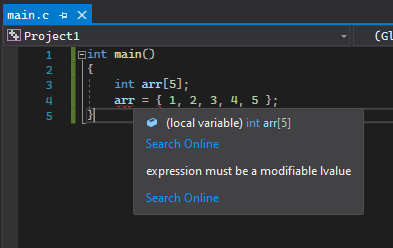

그런데, "expression must be a modifiable lvalue", 즉 수정 가능한 좌측값이 아니라는 오류가 표시됩니다. `arr[0]`이나 `arr[1]`은 좌측값인데, 왜 `arr`은 좌측값이 아닐까요? 나중에 다루겠지만, `arr`은 좌측값이 맞습니다. `arr`에 주소 연산자를 사용하여 `&arr` 처럼 쓸 수 있습니다. 하지만 배열이 배열로서 동작할 수 있는 경우는

* 배열이 주소 연산자와 사용되는 경우
* 배열이 `sizeof` 연산자와 사용되는 경우

로만 한정되어있습니다. 이 두 가지 경우가 아니면 배열은 그 배열의 첫번째 원소의 주소값을 가지는 **우측값 포인터**가 됩니다. 즉, `arr`이 504\~523번을 차지하고 있다고 가정했을 때, `&arr`이나 `sizeof arr`처럼 쓰지 않으면, `arr`은 결과값이 `504`이고 자료형이 `int *`인 우측값이 됩니다. 이런 특성때문에, 배열은 초기화 후 **대입이 불가능합니다**.

"첫번째 원소의 주소값을 가진다"라는 말을 자세히 알아보겠습니다.

> 포인터도 우측값이 될 수 있다는 점에 주의해주세요. `arr`이 포인터로 변환되었을 때, 그 결과값이 `504`가 되는 것은 맞지만, `504`라는 값이 들어있는 메모리 공간은 특정할 수 없습니다. 즉, 좌측값이 아니기 때문에 우측값이 됩니다.

> `&arr`의 자료형은 `int *`이 아니라 `int (*)[5]`, 즉 배열을 가리키는 포인터라는 것에 주의해주세요. 이것에 대해선 나중에 복잡한 포인터에 대해 배울 때 다루도록 하겠습니다.

```c
#include <stdio.h>

int main()
{
    int arr[3] = { 1, 2, 3 };
    int *p = arr;
    scanf("%d", p);
    printf("%d %d %d", arr[0], arr[1], arr[2]);
}
```
```
: 5
5 2 3
```

`scanf`에 들어가는 포인터를 식 `arr`으로 초기화하니 첫번째 원소의 값이 바뀌었습니다. 아까 첨자 연산자는 `배열의 주소 + sizeof(원소의 자료형) × 첨자`를 계산한다는 것을 배웠습니다. `arr[0]`에서 첨자의 값은 `0`이니, `arr[0]`의 주소는 배열의 주소와 같다는 것을 알 수 있습니다. 따라서 포인터에 `arr`을 대입한 건, `&arr[0]`과 같은 효과를 발휘합니다.

> `arr`과 다르게 `*arr`은 좌측값이 맞습니다. `scanf`가 작동하기 전, `*arr`은 결과값이 `1`이고, `1`이 504번 공간에 들어가있다는 것을 특정할 수 있습니다.

```c
#include <stdio.h>

int main()
{
    int arr[3] = { 1, 2, 3 };
    scanf("%d", &arr[0]);
    printf("%d %d %d", arr[0], arr[1], arr[2]);
}
```
```
: 5
5 2 3
```

이렇게 배열이 자동적으로 포인터로 변환되는 것은 암시적 변환의 일종입니다.

## 포인터 출력하기

포인터도 `printf`로 출력하는 것이 가능합니다. 포인터를 출력할 땐 형식 지정자 `%p`를 사용합니다.

```c
#include <stdio.h>

int main()
{
    int i;
    printf("%p", &i);
}
```
```
00F5FDDC
```

주소가 16진수로 출력되는 것을 알 수 있습니다. 지금까지 제가 예시를 들었을 땐 `280`, `120`등 작은 값을 사용했지만, 실제 변수의 주소는 꽤 큰 값입니다.

> 변수가 대응된 주소는 여러 요인에 의해 바뀝니다. 위 출력 결과는 예시 출력으로, 프로그램을 실행할 때 마다 바뀌고, 실행하는 컴퓨터나 환경에 의해서도 변합니다. 이것이 어떻게 바뀌게 되는지는 나중에 다룰 예정입니다.

> 아까 포인터의 크기를 출력하셨을 때 8이 나왔을 경우, 위 예시 출력처럼 8자리 16진수가 아니라 16자리 16진수가 출력됩니다.

`printf`로 포인터를 출력할 수 있는 것처럼 `scanf`로 포인터를 입력받을 수 있습니다.

```c
#include <stdio.h>

int main()
{
    int *p;
    scanf("%p", &p);
}
```

그런데 여러분이 지금까지 워드나 크롬같은 프로그램을 사용하시면서 직접 주소를 입력해야했던 적이 있나요? 적어도 전 그런 경우를 본 적이 없습니다. 이 기능은 여러분이 앞으로 쓸 일이 없을 것입니다.

## 포인터 산술 연산(pointer arithmetic)

아까 배열이 포인터로 암시적으로 변환되지 않을 조건에 첨자 연산자가 없었던 것, 기억하시나요? 바꿔 말하자면, `arr[n]`에서의 `arr`은 배열이 아니라 포인터 우측값이라는 뜻입니다. 앞에서 이야기하지는 않았지만, 이미 포인터가 갖고 있는 정수로 산술 연산을 하고 있었습니다.
```c
#include <stdio.h>

int main()
{
    int arr[] = { 1, 2, 3 };
    int *p = arr;
    printf("%d %d %d", p[0], p[1], p[2]);
}
```
```
1 2 3
```
여기서 `p`처럼 0번째 원소를 가리키는 포인터가 아니라, 1번째, 2번째 원소를 가리키는 포인터를 가져오려면 `&p[1]`, `&p[2]`처럼 쓰면 됩니다. 그런데 C에선 산술 연산을 할 때 이것보다 더 좋은 방법을 쓸 수 있는데요, 바로 산술 연산자들입니다. 포인터는 본질적으로 정수를 저장하는 자료형이기 때문에, 포인터도 `int`나 `float`과 마찬가지로 덧셈과 뺄셈 연산이 가능합니다.

```c
#include <stdio.h>

int main()
{
    int *p = (int *)0x10;
    printf("%p %p %p", p, p + 1, p - 1);
}
```
```
00000010 00000014 0000000C
```

> 위 예제처럼 임의의 정수를 주소값으로 쓸 수 있습니다. 하지만 아까 포인터를 출력해보셨으면 알겠지만, 실제 변수들은 고정된 위치에 있지 않기 때문에, 포인터에 정수를 직접 대입하는 경우는 거의 없습니다.

출력 결과를 10진수로 바꾸면 어떻게 되나요? `16 20 12`입니다. 1을 더하고 뺐더니 실제론 4가 더해지고 빼졌습니다. `arr`이 어떤 자료형 `T`의 배열이라고 했을 때, `arr[0]`과 `arr[N]`은 실제로 주소값이 `N * sizeof(T)` 차이난 것처럼, 자료형이 `T *`인 포인터도 마찬가지로 정수 `N`을 더하거나 뺐을 때 실제로는 `N * sizeof(T)`가 더하거나 빼집니다. 그럼, 이 성질을 참조 연산자와 주소 연산자와 섞으면, 포인터의 덧셈 연산자와 첨자 연산자의 신기한 관계가 나옵니다. 바로 `p[n]`이라는 식이 `*(p + n)`과 동치라는 점입니다. 마찬가지로 `&p[n]`은 `p + n`과 동치가 됩니다.

> 어떤 포인터 `p`에 대해 식 `&*p`의 결과값은 항상 `p`와 같습니다. `p[n]`이 `*(p + n)`과 같으니, `&p[n]`은 `&*(p + n)`이 되고, 다시 `p + n`이 됩니다.

```c
#include <stdio.h>

int main()
{
    int arr[] = { 1, 2, 3 };
    int *p = arr;
    printf("%d %d %d", *(p + 0), *(p + 1), *(p + 2));
}
```
```
1 2 3
```

수학에서의 덧셈은 보통 교환법칙이 성립하는 경우가 많습니다. 포인터의 덧셈도 마찬가지입니다. `p + n`과 `n + p`는 같은 결과값을 냅니다. 즉, 한 쪽은 정수이고, 한 쪽은 포인터이기만 하면, 무엇이 좌우 어느쪽에 있든 정수인 쪽에 `sizeof(T)`를 곱해서 더합니다.

```c
#include <stdio.h>

int main()
{
    int *p = (int *)0x10;
    printf("%p %p %p", p, 1 + p, 2 + p);
}
```
```
00000010 00000014 00000018
```

C의 첨자 연산자도 이러한 덧셈 연산자의 유연성을 받아들였습니다. `i[j]`가 `*(i + j)`와 동치이고, `*(j + i)`랑 같으니 `j[i]`도 `i[j]`와 같다고 할 수 있습니다.

```c
#include <stdio.h>

int main()
{
    int arr[] = { 1, 2, 3 };
    printf("%d %d %d", 0[arr], 1[arr], 2[arr]);
}
```
```
1 2 3
```

코드가 약간 위화감이 들지만, 잘 작동하는 것을 확인할 수 있습니다. 또 포인터에 정수를 뺄 수 있는 것처럼, 첨자 연산자에서도 동일한 일이 가능합니다.

```c
#include <stdio.h>

int main()
{
    int arr[] = { 1, 2, 3 };
    int* p = arr + 2;
    printf("%d %d %d", (-2)[p], p[-1], *p);
}
```
```
1 2 3
```

> 여기서 사용된 `-` 연산자는 뺄셈 연산자가 아니라, 식의 앞에 붙어서 그 식에 `-1`을 곱하는 단항 연산자임에 주의해주세요(`-n` -> `(-1) * n`). 첨자 연산자가 이 연산자보다 우선순위가 높기 때문에, `-2[p]`라고 쓰면 `-(2[p])`로 해석되게 됩니다.

다시 수학으로 돌아가보겠습니다. `포인터1 + 정수 = 포인터2`입니다. 여기서 양 변에 `포인터1`을 빼면, `정수 = 포인터2 - 포인터1`가 됩니다. C에서도 이렇게 포인터끼리 뺄셈이 가능하고, 그 결과는 일반 정수가 됩니다.

```c
#include <stdio.h>

int main()
{
    int arr[] = { 1, 2, 3 };
    int diff = &arr[2] - &arr[0];
    printf("%d", diff);
}
```
```
2
```

`&arr[2]`와 `&arr[0]`은 실제로 8이 차이나지만, 포인터 덧셈에서 `sizeof(int)`를 곱했던 것처럼 뺄셈에선 `sizeof(int)`를 나눠주게 됩니다. 그래서 `diff`에는 `8÷4`의 결과인 `2`가 들어가게 됩니다.

> 포인터 뺄셈의 결과는 `int`가 아니기 때문에, 이 예제에서도 축소 변환이 일어나게 됩니다. 위에서 `sizeof`의 결과가 `int`가 아니라는 것을 다뤘는데요, 이 뺄셈의 결과 자료형도 `sizeof`의 결과 자료형과 함께 다루도록 하겠습니다.

> 서로 다른 자료형의 포인터 두 개를 빼는 코드도 컴파일은 됩니다. 하지만 그건 무언가 암시적인 형변환이 일어났기 때문이지, 유효한 C 코드이기 때문은 아닙니다. C는 소위 `약타입(weakly typed)` 언어라고 불리는데요, 암시적인 형변환을 허용하는 경우가 아주 많기 때문입니다. C++은 C보다 `강타입(strongly typed)`이라고 합니다. 왜냐하면 C++에선 C보다 암시적인 형변환을 허용하는 경우가 적기 때문입니다. 이 경우에서도 C++은 암시적인 형변환을 허용하지 않습니다. 서로 다른 종류의 포인터를 빼는 것은 C++에서 오류입니다.

일반 정수 자료형에서처럼 포인터에서도 복합 대입 연산자 `+=`, `-=`와 증감 연산자 `++`, `--`를 사용할 수 있습니다.

```c
#include <stdio.h>

int main()
{
    double arr[] = { 1, 2, 3 };
    double* p = arr;
    printf("%lf ", *(p++));
    printf("%lf ", *(++p));
    printf("%lf ", *p);
    p -= 2;
    printf("%lf ", *p);
    p += 2;
    printf("%lf ", *(p--));
    printf("%lf ", *(--p));
}
```
```
1.000000 3.000000 3.000000 1.000000 3.000000 1.000000
```

정수 자료형에서 증감 연산자가 `1`을 더하고 빼던 것 처럼 포인터에선 `sizeof(T)`를 더하고 빼는 것을 알 수 있습니다.

포인터의 덧셈과 뺄셈에서 `sizeof(T)`가 곱해지거나 나눠지는 이유는 무엇일까요? C에서 `sizeof(T)`를 자동으로 곱해주지 않는다고 가정해봅시다. 자료형이 `int`인 변수 `i`가 812\~815를 차지하고 있다고 했을 때, `&i + 1`은 813이 됩니다. 여기서 새 변수 `j`를 만들어 `j = *(&i + 1)`처럼 대입하겠습니다. 그럼 `j`에는 813\~816에 들어있던 정수가 대입되게 되는데, 의미있는 값이 들어있을 것이라고 말하기 힘듭니다. 만약에 이 상황에서 배열을 섞어쓴다고 하면, `j = arr`이라고 했을 때 `arr[n]`을 쓰기 위해선 `j + n * sizeof(int)`라고 써야 합니다. 이 때 어떤 프로그래머는 `sizeof(int)`를 곱하는 것을 까먹을 수도 있는데요, 이러면 버그의 가능성이 높아집니다. 그래서 이런 여러가지 상황을 고려하여, C에선 포인터에 정수 `N`을 더하면 `sizeof(T)`가 자동으로 곱해지도록 되어있습니다.

> 이 부분은 `메모리 정렬(Memory alignment)`이라는 것과도 밀접한 연관을 맺고 있습니다. 지금까지의 예제에서 `int` 변수와 배열의 주소값이 모두 `4`의 배수였다는 것을 눈치채고 계셨나요? 실제 컴퓨터에선 메모리 구조에 의해, n바이트의 정수/부동소수점 자료형은 메모리 주소가 n의 배수인 공간에서부터 n바이트를 차지하고 있어야 합니다. 즉, `int`가 8\~11을 차지하는 것은 8이 4의 배수이기 때문에 괜찮지만 6\~9은 6이 4의 배수가 아니기 때문에 괜찮지 않습니다. 그냥 값을 불러들이는 속도가 느린 경우도 있지만, 연산장치의 종류에 따라 메모리 정렬이 올바르지 않으면 작동을 멈추는 경우도 있습니다. 메모리 정렬에 관한 것도 나중에 다룰 예정입니다.

[다음: 제어 흐름](../7-control-flow)