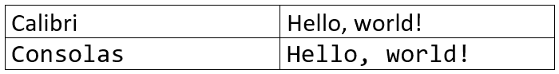
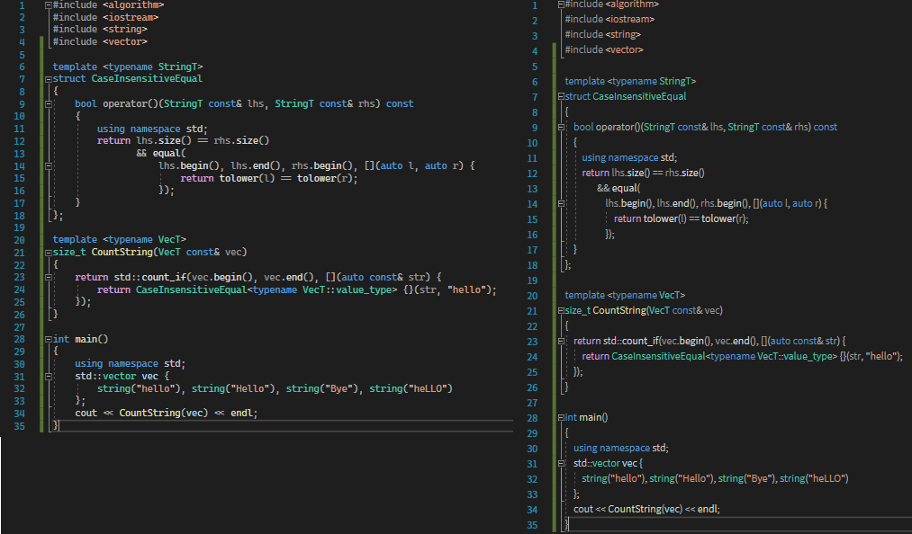

# Visual Studio 에디터의 기능

자주 사용하는 Visual Studio 에디터의 기능을 설명합니다.

## 폰트 설정

코딩을 위해 전용 에디터를 사용하는 것처럼, 코딩을 위한 전용 폰트도 있습니다. 기본적으로 이러한 폰트들은 모든 글자의 너비가 같습니다.

Calibri의 `H`와 `l`의 너비는 다른 반면에, Consolas의 `H`와 `l`은 너비가 같다는 것을 확인할 수 있습니다. 이렇게 모든 글자의 너비가 같은 폰트를 `고정폭 폰트(monospaced font)`라고 합니다. 고정폭 폰트를 사용하면 코드를 더 잘 정리할 수 있고, 코드의 가독성을 높일 수 있습니다.

> 폰트에 의한 차이를 보여주기 위해 일부러 복잡한 코드를 넣었으니 걱정하지 않으셔도 괜찮습니다. 위 예제의 프로그램은 `3`을 출력합니다.

코드의 가독성을 더 높이기 위해 요즘 나오는 코딩용 폰트는 더 다양한 기능을 가집니다.

* `O`와 `0`, `l`와 `1` 등 모양이 비슷한 글자들이 잘 구분되도록 합니다.